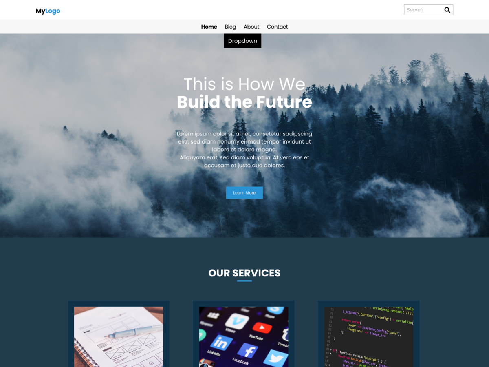

<h1 align="center"> Tema WP Devs Versão: 1.0</h1>

Esse tema foi criado para um site simples, totalmente gerenciado, com internacionalização pronto para tradução em várias linguas

  <a href="#-tecnologias">Tecnologias</a>&nbsp;&nbsp;&nbsp;|&nbsp;&nbsp;&nbsp;
  <a href="#-projeto">Projeto</a>&nbsp;&nbsp;&nbsp;|&nbsp;&nbsp;&nbsp;
  <a href="#-layout">Layout</a>&nbsp;&nbsp;&nbsp;|&nbsp;&nbsp;&nbsp;
  <a href="#memo-licença">Licença</a>

  

 

  

## 🚀 Tecnologias

Esse projeto foi desenvolvido com as seguintes tecnologias:

- PHP 8.1;
- HTML;
- CSS3;
- JavaScript;
- Wordpress 6.4.3
- Git e Github.

## 💻 Projeto

WP Devs foi projetado para ser flexível, versátil e aplicável a qualquer site. Sua coleção de modelos e padrões se adapta a diferentes necessidades, como apresentar um negócio, blogar e escrever ou apresentar trabalhos. Uma infinidade de possibilidades se abre com apenas alguns ajustes de cor e tipografia. WP Devs vem com variações de estilo e designs de página inteira para ajudar a acelerar o processo de construção do site, é totalmente compatível com o editor do site e aproveita as novas ferramentas de design introduzidas no WordPress 6.4.

Tags: one-column, custom-colors, custom-menu, custom-logo, editor-style, featured-images, translation-ready, blog, portfolio, news

Requires at least: 6.4
Tested up to: 6.4
Requires PHP: 7.0

## :memo: Licença

Esse projeto está sob a licença MIT.

---

Feito com ♥ by Vanderlei

# Tema WP Devs
